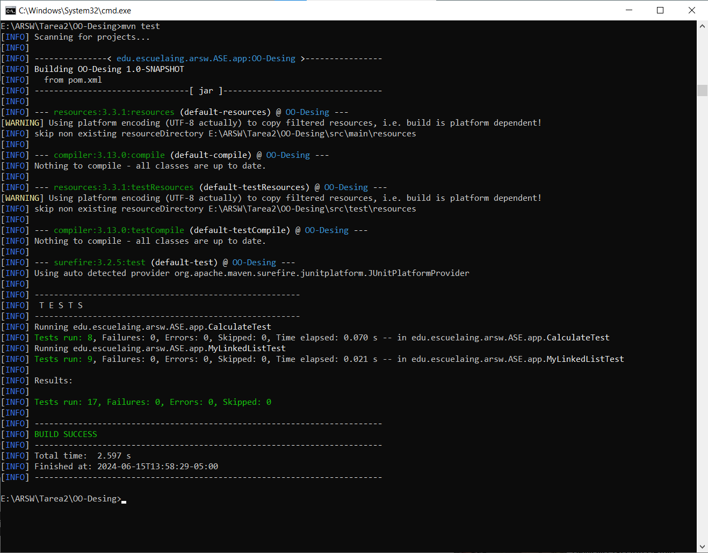
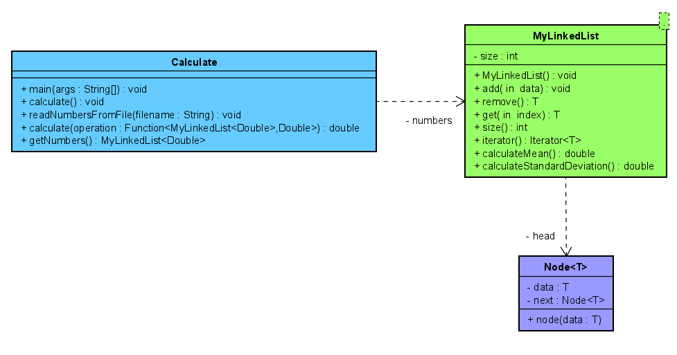
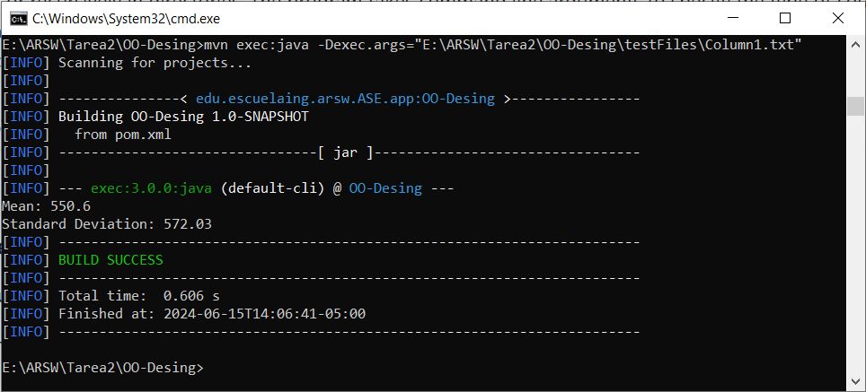

# Task 1 LOC Counting

This Java project provides a utility for counting the number of lines in Java source files, distinguishing between physical lines and lines of code (excluding comments and blank lines). It includes functionality to count lines in individual files or recursively in directories. The program takes command line arguments to specify the type of count (physical or lines of code) and the target directory or file. Unit tests are included to ensure the accuracy of the counting logic.


## Getting Started
Download the project from 
[the repository.](https://github.com/Sebasvasquezz/Task1-LOC-Counting)

### Prerequisites

* [Maven](https://maven.apache.org/): Automate and standardize the life flow of software construction

* [Git](https://www.git-scm.com/): Decentralized Configuration Manager

### Installing
1. Maven
    * Download Maven in http://maven.apache.org/download.html
    * You need to have Java installed (7 or 8)
    * Follow the instructions in http://maven.apache.org/download.html#Installation

2. Git
    * Download git in https://git-scm.com/download/win
    * Follow the instructions in https://git-scm.com/book/en/v2/Getting-Started-Installing-Git

## Running the tests

These tests focus on ensuring the correct functioning of the counting methods for both a file and all files in a directory, using two auxiliary test files (Calculator.java and HelloWorld.java). To delve deeper into the code base of these tests, review the CountLinesTest class.

Once the repository is downloaded, open a command prompt and run the following command to run the unit tests:

```
mvn test
```
The execution:



## Design

### Class Diagram
The class diagram was made by using Astah. To go deeper into it, check out the LOC-Counting.asta file.

* CountLines: Main class that contains the main method to start the program. It also contains methods for counting lines in a directory, in a file, and for counting physical and code lines.

    * main: Main method that handles program execution and accepts command line arguments.

    * countLinesInDirectory: Method to count lines in all files within a directory and its subdirectories. 

    * countLinesInFile: Method to count lines in a specific file.

    * countPhysicalLines: Method to count physical lines in a file and display the file name along with the result.

    * countLinesOfCode: Method to count lines of code in a file and display the file name along with the result.

This class diagram represents the basic structure and functionality of the line-of-code counting system, allowing lines to be counted in both individual files and entire directories.

### LOC/h Calculation
I spent 5 hours on this task and generated 168 lines of code.

    ```
    lines = 168 LOC
    time = 5 h
    LOC/h = 168/5 = 33.6
    ```

## Build the project
* Run the comand:
    ```
    mvn package
    ```
* Run the application:
    ```
    mvn exec:java -Dexec.args="<countType> <pathString>" 
    ```
    or 
    ```
    & 'C:\Program Files\Java\jdk-21\bin\java.exe' '-XX:+ShowCodeDetailsInExceptionMessages' '-cp' 'E:\ARSW\Tarea1\LOC-Counting\target\classes' 'edu.escuelaing.arsw.ASE.app.CountLines' loc E:\ARSW\Tarea1\LOC-Counting\src\main\java\edu\escuelaing\arsw\ASE\app 
    ```
* And the execution:
    
### Phase architecture
* To allow running the main application directly from the command line using Maven (mvn exec:java):
    ```
    <build>
    <plugins>
        <plugin>
          <groupId>org.codehaus.mojo</groupId>
          <artifactId>exec-maven-plugin</artifactId>
          <version>3.0.0</version>
          <configuration>
              <mainClass>edu.escuelaing.arsw.ASE.app.CountLines</mainClass>
          </configuration> 
    </plugins>
  </build>
    ```
## Built With

* [Maven](https://maven.apache.org/) - Dependency Management

## Authors

* **Juan Sebastian Vasquez Vega**  - [Sebasvasquezz](https://github.com/Sebasvasquezz)

## Date

June 12, 2024

## License

This project is licensed under the GNU License - see the [LICENSE.txt](LICENSE.txt) file for details.